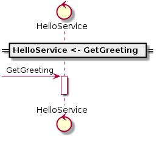

In this tutorial, we're going to create a simple Sysl specification (i.e. a `.sysl` file), and use the `sysl` command line tool to generate a variety of outputs. We will touch briefly of many of features of Sysl, and link to in-depth guides where you can learn more.
 

## Hello World

Sysl specifications appear similar to [YAML](https://en.wikipedia.org/wiki/YAML), with nested blocks of text organised with colons and indentation. However Sysl specifications are not just raw data: each block models a particular concept determined by its level and type.

Let's start with a simple example: modelling a greeting system that will authenticate the user to get their name, and then display a personalised greeting.

## Applications

 Create a new file called ` hello.sysl` with the following content:

```sysl
HelloService:
    ...
```

This is an empty model of an **application** called `HelloService`. An application is a component of a system, for example a web service, mobile app, or database.

The first line here consists of an application name followed by a colon to start an indented block, which will specify the named application.

The `...` on the second line is a **placeholder**. You can use placeholders when you don't yet have some details of the specification. Sysl specifications are living documents that evolve alongside the systems as they're designed and built.

This is already a valid Sysl specification. We can't generate anything interesting from it, but we can see that `sysl` is able to parse it and output the information as a **protobuf** for other tools to use:

```bash
$ sysl protobuf --mode=json hello.sysl
{
 "apps":  {
  "HelloService":  {
   "name":  {
    "part":  [
     "HelloService"
    ]
   },
   "endpoints":  {
    "...":  {
     "name":  "..."
    }
   },
   [...]
}
```

See [Exporting Sysl](cmd-export.md) for more about outputting Sysl protobufs.

## Endpoints

`HelloService` is a web service that returns the user's greeting. Services are modelled as a collection of **endpoints**, so we'll add a new `GetGreeting` endpoint below `HelloService:`:

```sysl
# The fantastic Hello World greeting system.

HelloService:
    GetGreeting(userId):
        ...
```

A few things are happening here:

`#` begins a comment. The first line is just describing the system represented by the specification (this is of course optional).

`GetGreeting` is the name of the endpoint. It is followed by a comma-separated list of **parameters** in `(` parentheses `)`. In this case, there's a single parameter called `userId`.

The block following the endpoint declaration models its behaviour. We've once again used the placeholder `...` to indicate that we don't have a detailed specification for it yet.

So far all we've specified is names, so we still can't generate anything of much use. But we're making progress! In the meantime, we can **validate** that the specification is still valid:

```bash
$ sysl validate hello.sysl
```

Validate displays no output if the input is valid.

## Communication

Let's introduce another application so that we can model some communication. The user is going to receive their greeting via a mobile app called `HelloApp`, which will fetch the greeting to display from `HelloService`.

As mentioned above, Sysl generally models components as "applications with endpoints". A natural interpretation for user-facing applications is that the app is an application, and each screen of the app is an endpoint.

You can probably guess what happens next:

```sysl
# The fantastic Hello World greeting system.

HelloService:
    GetGreeting(userId):
        ...

HelloApp:
    Greet:
        HelloService <- GetGreeting
```

We've added a new `HelloApp` application with a `Greet` endpoint, and specified its behaviour. The behaviour says that `Greet` does one thing: it sends a request to `HelloService`, invoking the `GetGreeting` endpoint.

:::note
At this level of detail, we're not interested in specifically what it does with the result. However Sysl has a special grammar for specifying more detailed behaviour as transformations.
:::

Now that our system has some communication happening, we can generate some useful output. **Diagrams** are the most common representation of Sysl specifications, since they are visual, rich, standard, and easily shared.

Let's create a **sequence diagram** illustrating the communication:

```bash
sysl sd --endpoint=Greet hello_endpoints.sysl
```

This produces the diagram below:



This shows the `GetGreeting` request to `HelloService`, but wait, where is `HelloApp`?

TODO(ladeo): Great question.

We can also produce an **integration diagram**, showing the components involved in the execution of an endpoint:

```bash
sysl ints  hello_endpoints.sysl -v --endpoint=Greet
```
